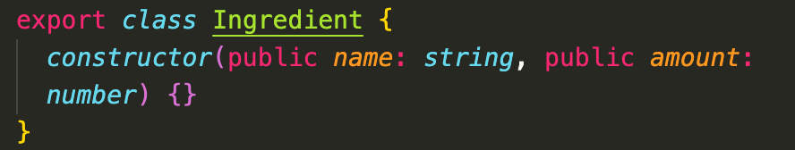

TypeScript notes
Taken from Typescript Crash Course, Traversy Media :
https://www.youtube.com/watch?v=BCg4U1FzODs

# TypeScript-Practice

### Notes

- typescript shortcut for creating a new class, can put accessors, types, and properties all as constructor arguments and forego definining them in class and assigning in constructor body

